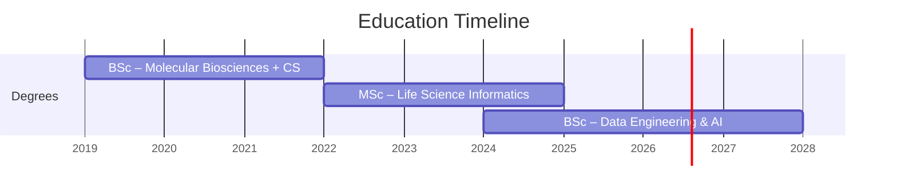

# Heidi Putkuri

Currently working as bioinformatician while expanding my knowledge to data engineering and machine learning. 

📍 Helsinki, Finland | 🔗 [GitHub]([link](https://github.com/heksaani)) | 💼 [LinkedIn]([link](https://www.linkedin.com/in/heidi-putkuri/)) | [projects](./projects.md)

mail: heidi.putkuri@hotmail.com

## Professional Profile

Bioinformatician with hands-on experience in next-generation sequencing (NGS) data analysis spanning human genetics and microbial research. Skilled in developing automated, reproducible analysis pipelines and applying machine learning to biological data. Experienced in high-performance and cloud computing environments, variant calling workflows, and large dataset management. Currently working in public health automating viral sequencing data analysis and database migration. Passionate about leveraging data science and machine learning to drive insights in molecular biology and bioinformatics.

## Education

I have a BSc in Molecular Biosciences with a minor in Computer Science  and an MSc in Life Science Informatics (Bioinformatics) both from the University of Helsinki. I am currently part time studying for a BSc in Data Engineering and AI at the University of Applied Sciences of Kajaani.

## Experience

### Bioinformatician

[Finnish Institute for Health and Welfare](https://thl.fi/en/main-page) | July 2025 - Present

- **Automated sequencing data analysis workflows**, reducing manual processing time, by developing Python-based pipeline orchestration for viral sequencing data.
- **Part of LIMS database migration** affecting thousands of records and hundreds of users, creating data views using sql to ensure data integrity and consistency during the migration process.

**Tools:** Python · Git · Nextflow · Oracle · Docker · Linux · SQL

---

### Master's Thesis Researcher

University of Helsinki | June 2024 - October 2024

**Thesis:** [Classifying Bacterial Species Using Methylation Patterns in Complex Microbial Communities](https://helda.helsinki.fi/items/bd303d03-ac17-4479-b5c5-2918cf1c96e5)

I worked full-time on my master’s thesis project, which involved developing a machine learning model to classify bacterial species based on NGS methylation data. This work is part of a peer-reviewed publication (Markkanen et al., 2026). The project demonstrated my ability to independently take a bioinformatics project from raw data to a publishable method. Random Forest was the best performing model, achieving 94% classification accuracy. My work was part of a larger scientific publication soon to be published. Current preprint is available [here](https://www.medrxiv.org/content/10.64898/2026.02.18.26346558v2).
I processed over 20 Gbs of sequencing data, creating a reproducible analysis workflow documented in a version-controlled Python codebase that is part of the publication repository found [here](https://github.com/melinamarkkanen/Methylation). 

**Tools:** Python · Scikit-learn · Pandas · Git · Jupyter Notebook ·

---

### Research Assistant

[Folkhälsan Research Institute - Eye Genetics Group](https://research.folkhalsan.fi/genetics/eye-genetics) | January 2023 - December 2024

I worked part-time during the academic year and full-time during the summer. My role involved analyzing next-generation sequencing (NGS) data to help the genetics team identify genetic variants associated with eye diseases. I developed and maintained bioinformatics scripts and pipelines for processing already aligned and raw sequencing data, including quality control, alignment, and variant calling. I also performed downstream analyses such as variant annotation to make the results interpretable for the research team. Additionally, I contributed to the migration of data storage and analysis pipelines to CSC’s high-performance computing environment, ensuring that our workflows were optimized for large datasets and could be executed efficiently on the cluster.

**Tools:** Linux · Python · SLURM · CSC Puhti · Bash · Git · Cloud storage (AWS in CSC Allas) · Sequence alignment · Variant calling

---

### Software Testing Intern

[FISION OY](https://www.fision.fi/fi/) | September 2021 - February 2022

I worked part time as a software testing intern at FISION, where I was responsible for testing the graphical user interface (GUI) of their software products. My role involved executing test cases, identifying and documenting bugs, and collaborating with the development team to ensure a high-quality user experience. Got to also take a look under the hood of software development and gained exposure to the full software development lifecycle.

**Tools:** GUI testing · documentation · Software QA

## Tech Stack
Currently using  for development,  for version control, and  and  for operating systems.

### Programming languages 

  

  

### Data & Machine Learning

          

### DevOps & Infrastructure

### Databases & Cloud

---

[Download PDF](){ .md-button onclick="window.print()" }
