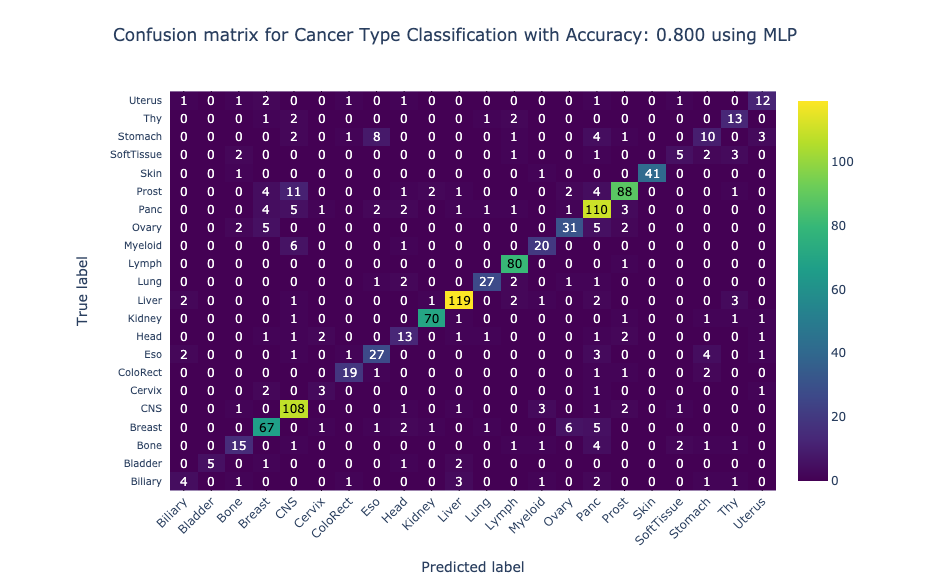

# Projects

## Waste bin empty date prediction

Project was part of course work but customer was client

### Model:

We experienced with two different time series models:
- ARIMA (AutoRegressive Integrated Moving Average)
- ETS (Error, Trend, Seasonality)

++ also calculated naive average model as benchmark

### Technologies used:
- python
- pandas

## Mutation signature classification | [github](https://github.com/heksaani/ML-in-molecular-biology/blob/main/GROUP_WORK/GROUP.ipynb)

### Objective:
Developed a machine learning pipeline to identify the primary tissue of origin in cancer samples by analyzing mutational signatures— patterns of mutations associated with specific biological processes or exposures.

### My contribution:

#### Data preprocessing & visualization:
Engineered the data preprocessing and Exploratory Data Analysis (EDA) workflow.

#### Modeling & Evaluation:
Implemented the MLP and combined all of the other classification algorithms (KNN, SVM, Random Forest, SGD, Logistic Regression, Naive Bayes) into a cohesive pipeline. Conducted hyperparameter tuning to optimize model performance.

#### Project Management: 
 Suggested to use git for version control, ensuring reproducibility.

### Key Results
Top Performer: The Multi-layer Perceptron (MLP) achieved a peak accuracy of 80% after hyperparameter tuning.

 
### Tech Stack
**Languages & Data:** Python (Pandas, NumPy)  
**Modeling:** Scikit-learn (KNN, SVM, Random Forest, SGD, Logistic Regression, Naive Bayes, MLP)   
**Visualization:** Matplotlib, Seaborn, Plotly

## Health data notebook

