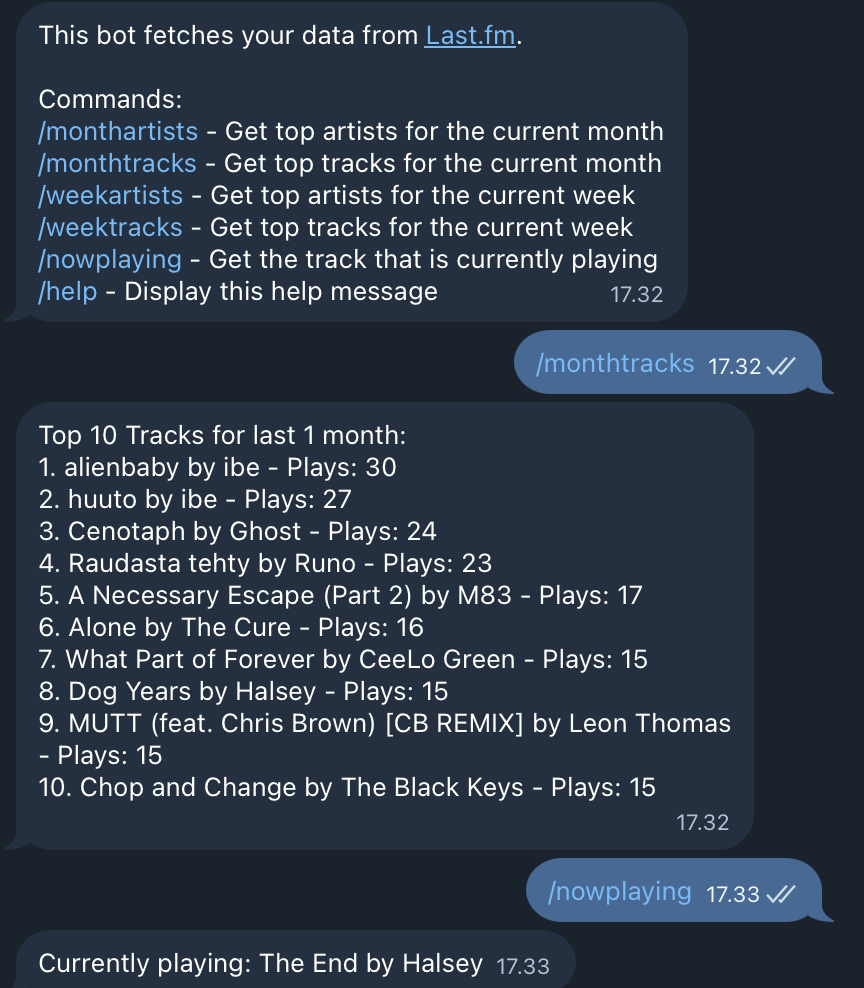
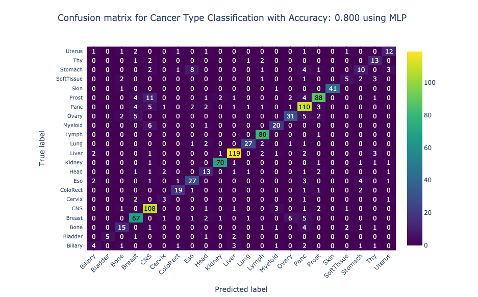

# Projects

## Classifying Bacterial Species Using Methylation Patterns in Complex Microbial Communities (2024-2025)

Bioinformatics · Random Forest · Python

Developed a novel computational method to classify bacterial species within complex microbial communities — a problem that traditional approaches struggle with due to overlapping signals. Converted raw methylation signals from next-generation sequencing data into position weight matrix representations and trained a Random Forest classifier, achieving 94% species classification accuracy on real wastewater samples.
My work is part of scientific publication (Markkanen et al., 2026) and is available as a preprint [here](https://www.medrxiv.org/content/10.64898/2026.02.18.26346558v2), and the analysis workflow is documented in the github repository found [here](https://github.com/melinamarkkanen/Methylation).

## LASTFM telegram bot (2025) | [github](https://github.com/heksaani/LASTFMBOT)

Python · Telegram API · Last.fm API

Built a Telegram bot that pulls and surfaces personalised music listening statistics from Last.fm. Lets users query their listening history, top artists, and recent tracks directly from a chat interface — no app switching required.

## Classifying cancer tissue types (2024) | [notebook](https://github.com/heksaani/ML-in-molecular-biology/blob/main/GROUP_WORK/GROUP.ipynb)

Machine Learning · Python · Scikit-learn · Plotly

Led the technical core of a team project to classify cancer primary tissue of origin using mutational signatures — patterns of DNA mutations tied to specific biological processes and exposures. Built the full data pipeline from pieces built by each team member, integrating multiple machine learning models and performing hyperparameter tuning to optimize performance. Evaluated a range of models (KNN, SVM, Random Forest, SGD, Logistic Regression, Naive Bayes, MLP) and found that the Multi-layer Perceptron (MLP) achieved a peak accuracy of 80% after hyperparameter tuning, outperforming all other models. Also introduced Git-based version control to the team workflow, improving reproducibility across the project.

Top Performer: The Multi-layer Perceptron (MLP) achieved a peak accuracy of 80% after hyperparameter tuning.

## Automated humidity monitoring (2024) | [github](https://github.com/heksaani/arduino)

Arduino · C++ · IoT · Embedded Systems

Designed and built an automated humidity monitoring and ventilation control system with my friend for a greenhouse environment using the Arduino UNO R4 WiFi. The system reads sensor data in real time and triggers ventilation responses automatically, removing the need for manual monitoring.

## Health data notebook (2022) | [github](https://github.com/heksaani/DataScienceProject/blob/main/HealthNotebook.ipynb)

Python · Jupyter · Data Analysis

Designed an interactive data analysis tool that ingests personal health data and generates tailored sleep improvement recommendations. Built as a Jupyter notebook to maximise accessibility within a short timeframe, with a proposed path toward a full web or mobile application. Introduced me to the full cycle of data science work: problem framing, data handling, insight generation, and communicating results to non-technical users.
